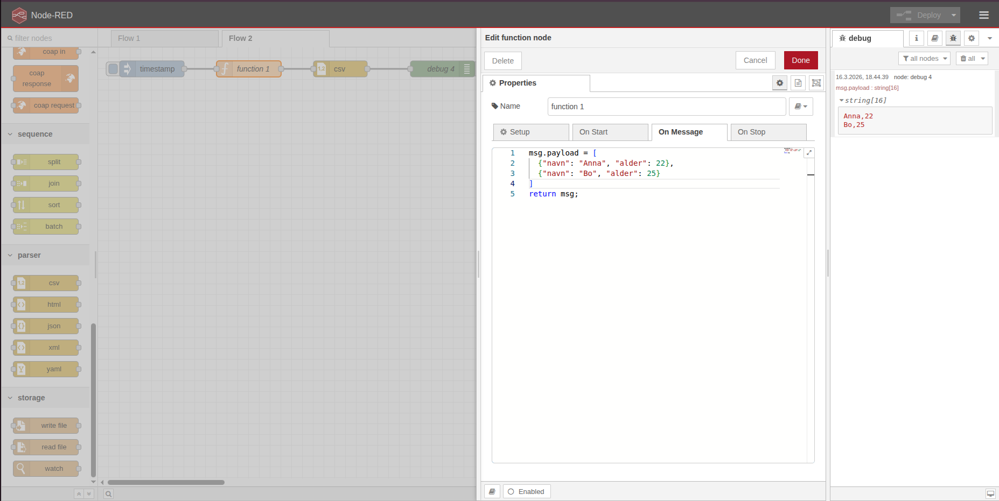
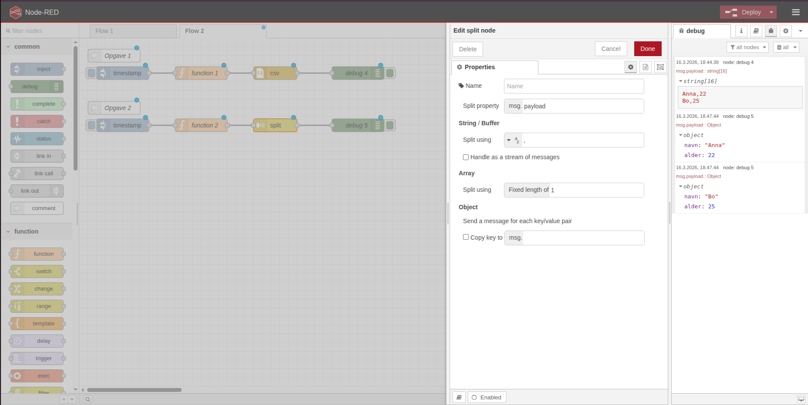
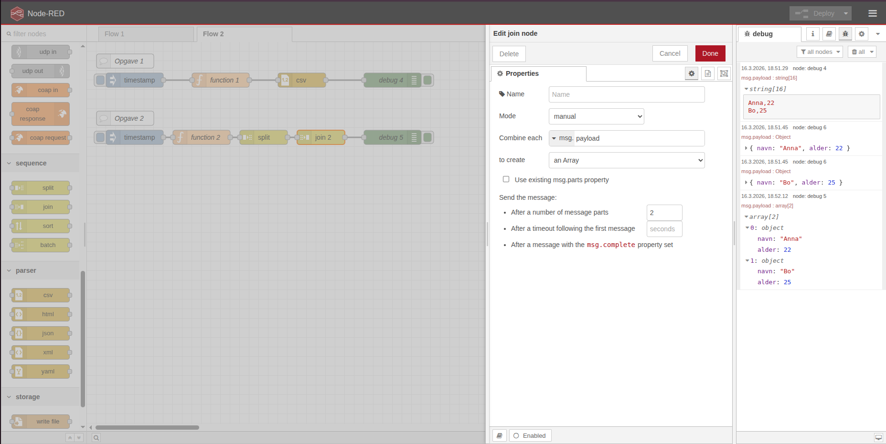
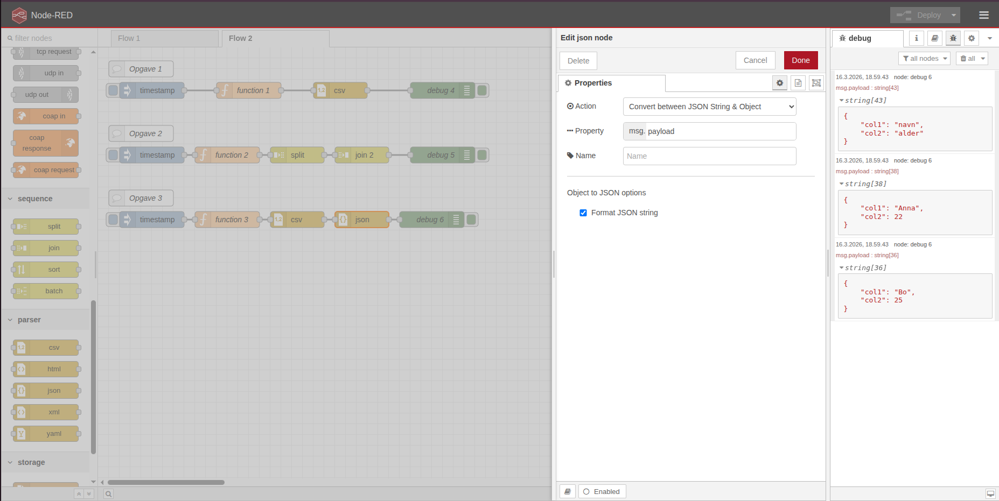
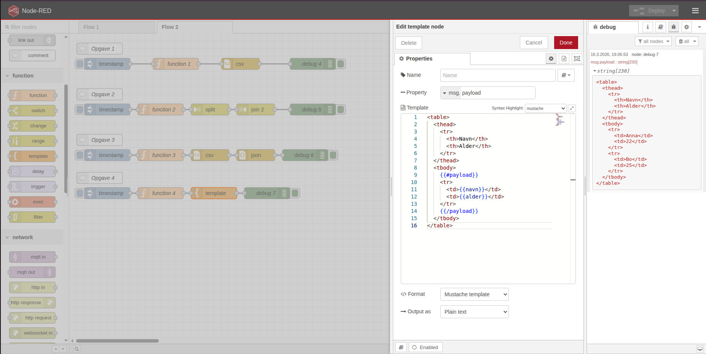
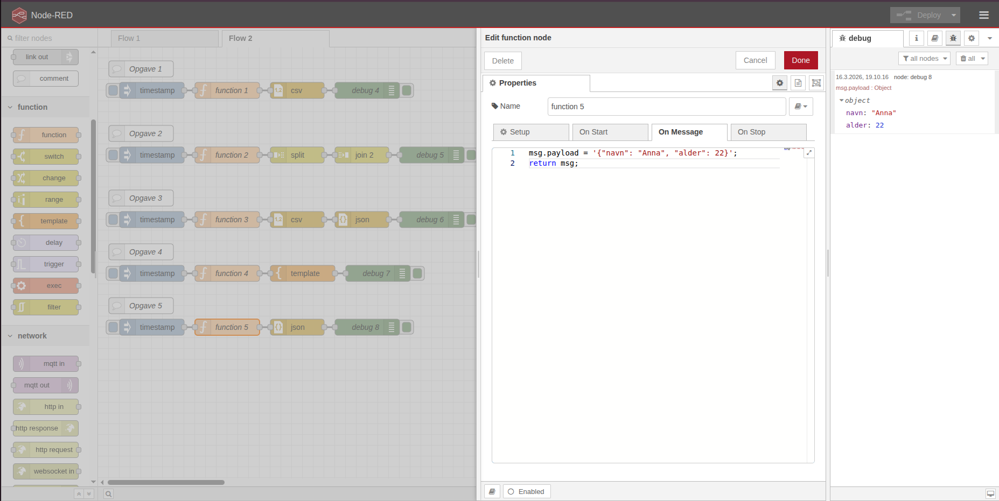
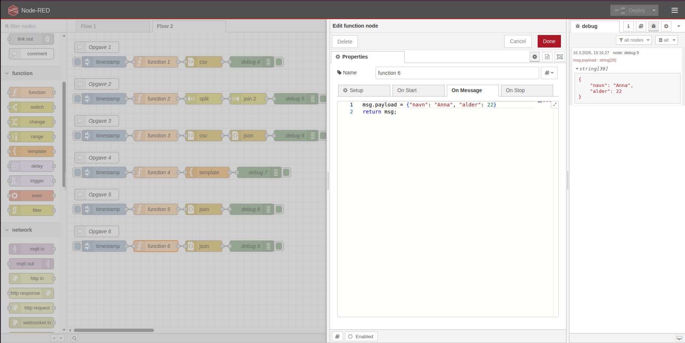

# 🟠 Node-RED: Avancerede Opgaver

Her får du opgaver, hvor du arbejder med mere avancerede noder og funktioner i Node-RED. Du får hands-on erfaring med dataformater, filhåndtering og flow-manipulation.

---

## 1️⃣ CSV Node
**Opgave 1:**
- Konverter en liste af objekter til CSV-format og vis resultatet i Debug.

**Step-by-step:**
1. Opret en Inject-node forbundet til en Function-node, der sender en array af objekter, fx:
   ```javascript
   msg.payload = [
     {"navn": "Anna", "alder": 22},
     {"navn": "Bo", "alder": 25}
   ];
   return msg;
   ```
2. Tilslut Function-node til en CSV-node.
3. Tilslut CSV-node til en Debug-node.
4. Deploy flowet.
5. Tryk på Inject-knappen og se CSV-resultatet i Debug-vinduet.



**Opgave 2:**

Brug Join-node til at samle flere beskeder til én samlet besked (fx fra Split-node).
 
**Step-by-step:**
1. Opret en Inject-node forbundet til en Function-node, der sender en array af objekter, fx:
    ``` javascript
    msg.payload = [
     {"navn": "Anna", "alder": 22},
     {"navn": "Bo", "alder": 25}
   ];
   return msg;
    ```
2. Tilslut Function-node til en Split-node, så arrayet deles op i enkeltbeskeder. Brug comma "," som separator i Split-node.



3. Tilslut Split-node til en Join-node.
4. Sæt Join-node til at samle beskederne til en array (vælg 'manual mode' og antal beskeder, fx 2).
5. Tilslut Join-node til en Debug-node.
6. Deploy flowet.
7. Tryk på Inject-knappen og se, at beskederne samles til én samlet array i Debug-vinduet.




**Step-by-step:**
1. Opret en Inject-node forbundet til en Function-node, der sender en tekststreng med CSV-data, fx:
   ```javascript
   msg.payload = 'navn,alder\n
   Anna,22\n
   Bo,25';
   return msg;
   ```
2. Tilslut Inject-node til en CSV-node (sæt CSV-node til 'Convert between JSON & JavaScript Object'). Sæt flueben i Format JSON string.



3. Tilslut CSV-node til en Debug-node.
4. Deploy flowet.
5. Tryk på Inject-knappen og se JSON-resultatet i Debug-vinduet.
6. Brug evt. en Function-node til at behandle JSON-dataen videre.

---

## 2️⃣ HTML Node
**Opgave 1:**
- Brug HTML-node til at formatere en besked som en tabel og vis den i Dashboard eller Debug.

**Step-by-step:**
1. Opret en Inject-node forbundet til en Function-node, der sender en array af objekter, fx:
   ```javascript
   msg.payload = [
     {"navn": "Anna", "alder": 22},
     {"navn": "Bo", "alder": 25}
   ];
   return msg;
   ```
2. Tilslut Function-node til en Template-node, hvor du skriver HTML-kode til at lave en tabel:
   ```html
   <table>
   <thead>
      <tr>
         <th>Navn</th>
         <th>Alder</th>
      </tr>
   </thead>
   <tbody>
      {{#payload}}
      <tr>
         <td>{{navn}}</td>
         <td>{{alder}}</td>
      </tr>
      {{/payload}}
   </tbody>
   </table>
   ```
3. Tilslut Template-node til en Dashboard-node (fx tekst eller ui_template) eller Debug-node.
4. Deploy flowet.
5. Tryk på Inject-knappen og se den formaterede tabel i Dashboard eller Debug-vinduet.



---

## 3️⃣ JSON Node
**Opgave 1:**
- Modtag en tekststreng med JSON og konverter den til et JavaScript-objekt.

**Step-by-step:**
1. Opret en Inject-node forbundet til en Function-node, der sender en tekststreng med JSON, fx:
   ```javascript
   msg.payload = '{"navn": "Anna", "alder": 22}';
   return msg;
   ```
2. Tilslut Function-node til en JSON-node (sæt JSON-node til 'Convert between JSON & JavaScript Object').
3. Tilslut JSON-node til en Debug-node.
4. Deploy flowet.
5. Tryk på Inject-knappen og se det konverterede JavaScript-objekt i Debug-vinduet.
6. Brug evt. en Function-node til at arbejde videre med objektet.



**Opgave 2:**
- Konverter et objekt til en JSON-streng og send det videre til Debug eller fil.

**Step-by-step:**
1. Opret en Inject-node forbundet til en Function-node, der sender et objekt, fx:
   ```javascript
   msg.payload = {"navn": "Anna", "alder": 22};
   return msg;
   ```
2. Tilslut Function-node til en JSON-node (sæt JSON-node til 'Always convert to JSON String').
3. Tilslut JSON-node til en Debug-node eller Write File-node.
4. Deploy flowet.
5. Tryk på Inject-knappen og se JSON-strengen i Debug-vinduet eller i den gemte fil.



---

## 4️⃣ Split Node
**Opgave 1:**
- Modtag en array og brug Split-node til at dele den op i enkeltbeskeder.

**Step-by-step:**
1. Opret en Inject-node forbundet til en Function-node, der sender en array, fx:
   ```javascript
   msg.payload = [
     {"navn": "Anna", "alder": 22},
     {"navn": "Bo", "alder": 25}
   ];
   return msg;
   ```
2. Tilslut Inject-node til en Split-node.
3. Tilslut Split-node til en Debug-node.
4. Deploy flowet.
5. Tryk på Inject-knappen og se, at hver enkelt besked fra arrayet vises separat i Debug-vinduet.

---

## 6️⃣ Write File Node
**Opgave 1:**
- Skriv data fra et flow eller tidligere opgave til en fil på systemet (fx en log eller en rapport).

**Step-by-step:**
1. Opret en Inject-node forbundet til en Function-node, der sender den data, du vil gemme, fx en tekststreng eller JSON-objekt.
2. Tilslut Function-node til en Write File-node.
3. Konfigurer Write File-node med filsti og skrivemetode (append eller overwrite).
4. Tilslut Write File-node til en Debug-node for at bekræfte, at filen er skrevet.
5. Deploy flowet.
6. Tryk på Inject-knappen for at skrive dataen til filen.

---

## 7️⃣ Read File Node
**Opgave 1:**
- Læs data fra en fil og vis indholdet i Debug eller Dashboard.

**Step-by-step:**
1. Opret en Inject-node, der aktiverer læsningen (fx en timestamp).
2. Tilslut Inject-node til en Read File-node.
3. Tilslut Read File-node til en Debug-node.
4. Deploy flowet.
5. Tryk på Inject-knappen og se indholdet af filen i Debug-vinduet.

---

Når du har løst opgaverne, har du fået erfaring med avancerede dataformater, filhåndtering og flow-manipulation i Node-RED!
