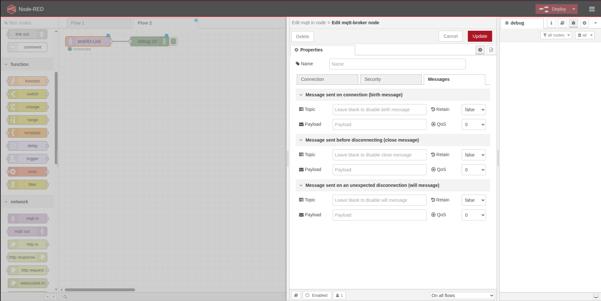

# MQTT Birth and Last Will Messages
Opgave 05 i dag 2 fokuserer på at implementere "Birth" og "Last Will" beskeder i MQTT for at forbedre pålideligheden af din IoT-kommunikation.

## 🎯 Mål
Efter denne øvelse vil du kunne:
- Forstå konceptet bag Birth og Last Will beskeder i MQTT.
- Implementere Birth og Last Will beskeder i din MQTT kommunikation.
- Teste og validere funktionaliteten af disse beskeder i et IoT setup.

## 📋 Baggrund
I MQTT protokollen er "Birth" og "Last Will" beskeder vigtige funktioner, der hjælper med at sikre pålidelig kommunikation mellem enheder. "Birth" beskeder sendes, når en enhed først tilsluttes, og giver oplysninger om enhedens status. "Last Will" beskeder sendes, hvis en enhed uventet disconnecter, og informerer andre enheder om dette.

## 🛠️ Opgavebeskrivelse
1. **Forberedelse**:
   - Sørg for, at din MQTT broker er oppe at køre, og at du har adgang til den via din MQTT klient (f.eks. Node-RED eller en Python script).
2. **Implementering af Birth besked**:
   - Opret en funktion i din MQTT klient, der sender en "Birth" besked, når enheden tilsluttes.
   - "Birth" beskeden skal indeholde oplysninger om enhedens ID, type og status.
3. **Implementering af Last Will besked**:
   - Opret en funktion i din MQTT klient, der sender en "Last Will" besked, hvis enheden uventet disconnecter.
   - "Last Will" beskeden skal indeholde oplysninger om enhedens ID og en besked, der informerer om, at enheden er offline.

   

4. **Test og validering**:
   - Test din implementering ved at tilslutte og frakoble enheden.
   - Kontroller, at "Birth" beskeden sendes korrekt ved tilslutning.
   - Simuler en uventet frakobling og kontroller, at "Last Will" beskeden sendes korrekt.
