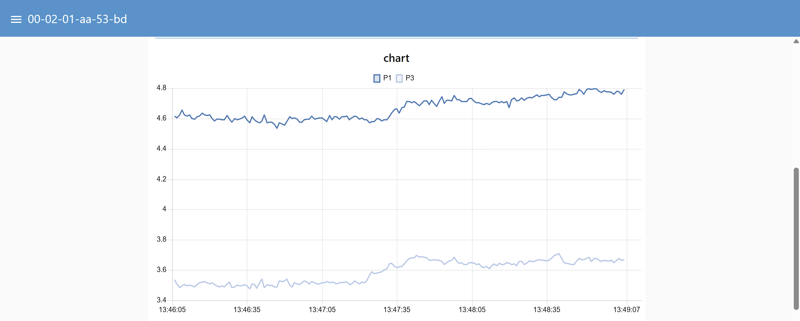
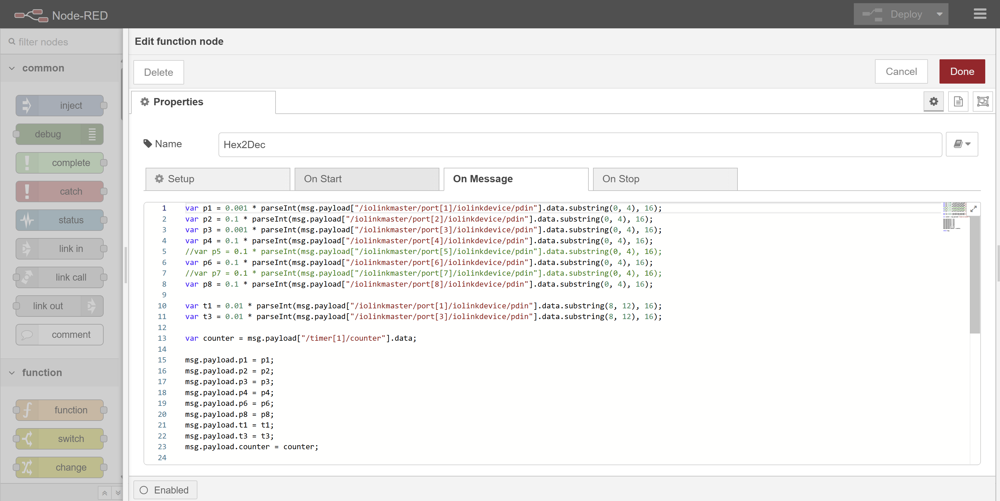

## 🔧 Projektopgave: Fjernvarmedata – Node-RED visualisering

### Baggrund

Kunden **Bjarke** havde et anlæg til overvågning af fjernvarme-data baseret på **IO-Link sensorer**, der måler **tryk (P)** og **temperatur (T)** på flere punkter i et fjernvarmesystem.
Virksomheden, der skulle levere løsningen, gik konkurs – og Bjarke har nu kun rå data fra sin IO-Link-master samt nogle få skærmbilleder af det tidligere Node-RED-flow.

Jeres opgave er at **genskabe og videreudvikle løsningen**, så Bjarke igen kan se sine data live, gemme dem og præsentere dem i et brugervenligt dashboard.

---

### 🎯 Opgavens mål

1. **Modtag sensordata** via MQTT fra IO-Link-masteren.
2. **Dekod** data fra hex-format til decimale værdier (tryk i bar, temperatur i °C).
3. **Log** data til CSV-fil (med dansk decimalseparator).
4. **Visualisér** tryk- og temperaturdata i Node-RED Dashboard:

   * Live **gauge-visninger** af de enkelte sensorer.
   * **Line charts** med historiske forløb.
5. **Tilføj “sidst set”-tidspunkt**, så man kan se hvornår data sidst blev opdateret.

---

### Billeder fra den oprindelige løsning
Løsning i Node-RED:

Dashboard visning:





---

### 🧠 Tekniske krav

* MQTT-emne: `00-02-01-aa-53-bd/#`
* IO-Link-data modtages som hexadecimale værdier under fx:

  ```
  /iolinkmaster/port1/iolinkdevice/pdin
  /iolinkmaster/port3/iolinkdevice/pdin
  /iolinkmaster/port5/iolinkdevice/pdin
  ```
* Temperatur og tryk udtrækkes med `substring()` fra datafeltet (hint: brug `parseInt(hex,16)`).
* Konverteringsfaktor for tryk og temperatur vises i funktionsnoden (`Hex2Dec`).
* CSV-fil skal gemmes under `/home/pi/data/…` (eller på Windows: `C:\data\…`).

---

### 💡 Forslag til flowstruktur

1. **MQTT in** → modtag data
2. **Function node (“Hex2Dec”)** → konverter hex → dec
3. **Change nodes** → adskil værdier (P1–P8, T1–T3)
4. **CSV node** → log data
5. **UI Gauge og Chart** → visning af aktuelle og historiske data
6. **UI Text** → vis “Sidst set”
7. (Bonus) **HTTP Request / Template** → send data videre til en ekstern service

---

### 📦 Ekstraopgaver (for de hurtige)

* Tilføj **MQTT Last Will/Birth message**, så systemet melder “online/offline”.
* Implementér **alarm** (fx rød farve) hvis tryk falder under et bestemt niveau.
* Gem daglige logfiler automatisk med dato i filnavnet.
* Brug **context-storage** (flow- eller global-variabler) til at beregne middelværdier.
* Byg et simpelt **dashboard til mobilen** (kun de vigtigste værdier).

---

### 📸 Tilgængeligt materiale

De medfølgende billeder viser:

* Node-RED-flowets overordnede struktur
* Dashboard med grafer og gauges
* Eksempel på funktionsnoden `Hex2Dec`
* Eksempel på CSV-logning
* MQTT-topicstruktur

---
