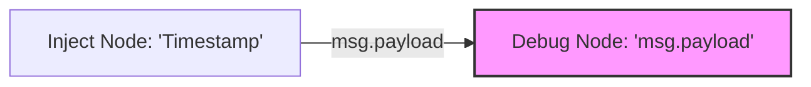

# Workshop 1: Node-RED Installation 🚀
> "If you can't measure it, you can't manage it."

---
layout: default
---

# Hvorfor Node-RED? 🤖
Inden vi installerer, skal vi forstå værktøjet:

* **Low-code:** Hurtig udvikling af logik uden at skrive 100-vis af linjer kode.
* **Event-driven:** Perfekt til IoT, hvor vi reagerer på sensordata.
* **Browser-baseret:** Programmering direkte i din Chrome/Edge browser.

<div v-click class="mt-10 p-4 border-l-4 border-blue-500 bg-blue-50 dark:bg-blue-900/20">
  <strong>Målet for i dag:</strong> 
  At have en kørende Node-RED instans, der starter automatisk og er klar til modtage data.
</div>

---
layout: two-cols
---

# Installation: 2 Veje 🛠️

Vælg den metode, der passer til dit setup:

### A: Lokal Installation (Node.js)
Kræver at du har Node.js installeret på din PC.
```bash
npm install -g --unsafe-perm node-red
```

### B: Docker (Anbefalet til Industri)
Den moderne måde at køre software på i industrien (Edge Devices).
```bash
docker run -it -p 1880:1880 --name mynodered nodered/node-red
```

::right::

<v-click>

### Sådan starter du:
1. Åbn din terminal/kommandoprompt.
2. Kør kommandoen til venstre.
3. Åbn din browser og gå til:
   `http://localhost:1880`

<div class="mt-4 p-2 bg-yellow-100 dark:bg-yellow-900/30 rounded text-sm">
  <carbon:warning class="inline mr-2"/> 
  Husk at tjekke din firewall, hvis du skal tilgå den fra en anden PC på netværket!
</div>

</v-click>

---

# Dit første Flow: "Hello MMS" 💡
Lad os teste om alt virker.

<v-click>

1. Find en **Inject** node (input).
2. Find en **Debug** node (output).
3. Forbind dem med en ledning (wire).
4. Tryk **Deploy** i øverste højre hjørne.
5. Tryk på knappen på din Inject node.

</v-click>

<div v-click class="mt-8">



</div>
```