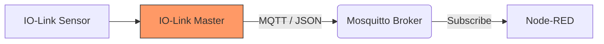

# Workshop 2: IO-Link & MQTT Integration

I dag forbinder vi den fysiske verden med den digitale. Vi skal se på, hvordan data flytter sig fra en industriel sensor til vores Node-RED gateway via MQTT.

---
layout: section
---

# Workshop 2: IO-Link & MQTT 📡
> "Fra rå sensordata til brugbar information."

---
layout: default
---

# Hvad er IO-Link i en IoT-verden? 🏗️
IO-Link er ikke bare en sensor-protokol; det er broen til data.

* **Punkt-til-punkt:** Digital kommunikation direkte til sensoren.
* **Parameterstyring:** Skift konfiguration på sensoren via software.
* **Diagnostik:** Få besked før sensoren dør (Predictive Maintenance).

<div v-click class="mt-8">

### System Arkitekturen:


</div>

---
layout: two-cols
---

# MQTT: Protokollen vi bruger 📨

MQTT (Message Queuing Telemetry Transport) er standarden i IIoT.

* **Publish / Subscribe:** Enheder taler ikke direkte sammen, men via en "Broker".
* **Topics:** Svarer til mapper (f.eks. `mms/sensor1/temp`).
* **Lightweight:** Perfekt til ustabile netværk og små enheder.

::right::

<v-click class="ml-4">

### Dagens setup:
1. **Broker:** Vi bruger Mosquitto (kører ofte i Docker).
2. **Topic:** `mms/iot/workshop2`
3. **Payload:** Data sendes som **JSON**.

<div class="mt-4 p-2 bg-blue-100 dark:bg-blue-900/30 rounded text-sm">
  <carbon:information class="inline mr-2"/> 
  Husk: MQTT Brokeren er posthuset – Node-RED er modtageren.
</div>

</v-click>

---
layout: default
---

# Opsætning i Node-RED ⚙️

For at modtage data skal vi bruge en **mqtt in** node.

<div class="grid grid-cols-2 gap-4 mt-4">
<div v-click>

### 1. Konfigurer Broker
Dobbeltklik på noden og indsæt:
* **Server:** `localhost` (eller IP på din broker)
* **Port:** `1883`

</div>
<div v-click>

### 2. Sæt dit Topic
Indtast det topic din IO-Link master sender på:
* **Topic:** `mms/+/data` 
* *(+ er et wildcard for alle sensor-ID'er)*

</div>
</div>

<v-click>

```javascript {all|2|4-5}
// Eksempel på indkommende JSON data fra en IO-Link Master
{
  "SensorID": "Pressure_01",
  "Value": 4.2,
  "Unit": "Bar"
}
```

</v-click>

---
layout: default
---

# Praktisk Øvelse: "Parsing" 🛠️
Data fra IO-Link kommer ofte som JSON. Vi skal bruge en **JSON node** for at gøre det til et objekt, vi kan arbejde med.

**Opgave:**
1. Træk en **mqtt in** node ind.
2. Forbind den til en **json** node.
3. Brug en **debug** node til at se værdien i sidepanelet.

<div v-click class="mt-10 p-4 border-l-4 border-green-500 bg-green-50 dark:bg-green-900/20">
  <strong>Udfordring:</strong> 
  Kan du få en <i>Gauge</i> (viser) på dit Dashboard til at bevæge sig, når du aktiverer din sensor?
</div>

---