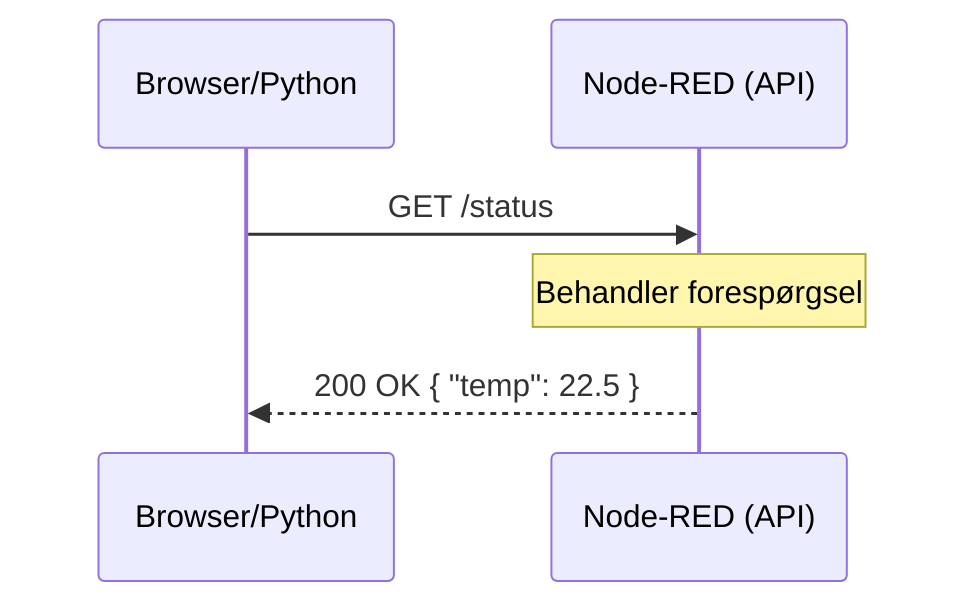

# Workshop 3: HTTP API & Server

I dag transformerer vi Node-RED fra en simpel gateway til en rigtig Web Server. Vi skal lære at bygge vores egne "endpoints", så vi kan dele data med resten af verden via HTTP.

---
layout: section
---

# Workshop 3: HTTP API & Server 🌐
> "Gør dine data tilgængelige for alle systemer."

---
layout: default
---

# Hvad er et HTTP API? 🔌
Kort fortalt: En måde hvorpå to computere kan tale sammen over netværket ved hjælp af "spørgsmål og svar".

* **Request (Forespørgsel):** En klient (f.eks. din mobil eller en Python-app) beder om data.
* **Response (Svar):** Serveren (Node-RED) sender data tilbage.
* **Metoder:**
    - **GET:** Hent data (f.eks. "Hvad er temperaturen lige nu?").
    - **POST:** Send data (f.eks. "Gem denne log-besked i databasen").

<v-click class="mt-8">



</v-click>

---
layout: two-cols
---

# HTTP Noderne i Node-RED 🛠️

For at lave et API skal vi bruge et "par":

### 1. http in (Input)
Dette er din "lyttepost". 
- Her vælger du metoden (**GET**) og din URL-sti (f.eks. `/mms/data`).

### 2. http response (Output)
Dette er dit svar til klienten.
- Den sender `msg.payload` tilbage til den, der spurgte.

::right::

<v-click class="ml-4">

### Opsætning:
1. Træk en **http in** node ind.
2. Forbind den til en **function** node (hvor vi laver data).
3. Forbind function noden til en **http response**.

<div class="mt-4 p-4 bg-blue-100 dark:bg-blue-900/30 rounded text-sm">
  <strong>Husk:</strong> En HTTP-forespørgsel "hænger", indtil den modtager et svar. Glem aldrig din <i>http response</i> node!
</div>

</v-click>

---
layout: default
---

# Eksempel: Lav et JSON API 📦

Vi vil lave et endpoint, der returnerer maskinstatus som JSON.

**I din Function Node:**
```javascript {all|2-6|7}
// Vi bygger et objekt med data fra vores sensorer
msg.payload = {
    station: "MMS-Lab-01",
    status: "Operativ",
    last_update: new Date().toISOString()
};

return msg;
```

<v-click class="mt-6">

### Test det selv:
1. Tryk **Deploy**.
2. Åbn en ny fane i din browser.
3. Skriv: `http://localhost:1880/mms/data`
4. Se dit JSON-svar direkte i browseren!

</v-click>

---
layout: default
---

# Praktisk Øvelse: "Styring via HTTP" 🕹️

Vi skal nu prøve at sende data *ind* til Node-RED via en **POST** request.

**Opgave:**
1. Lav et nyt flow med en **http in** sat til metoden `POST` og stien `/set/relay`.
2. Forbind den til en **debug** node.
3. Brug et værktøj (f.eks. en browser-extension eller terminalen) til at sende data.

<div v-click class="mt-10 p-4 border-l-4 border-yellow-500 bg-yellow-50 dark:bg-yellow-900/20">
  <strong>Case fra virkeligheden:</strong> 
  Forestil dig, at din Python-app (fra WS 4) skal fortælle Node-RED, hvornår den skal tænde for en pumpe. Det er her, HTTP API'et bliver din bro mellem de to verdener.
</div>

---